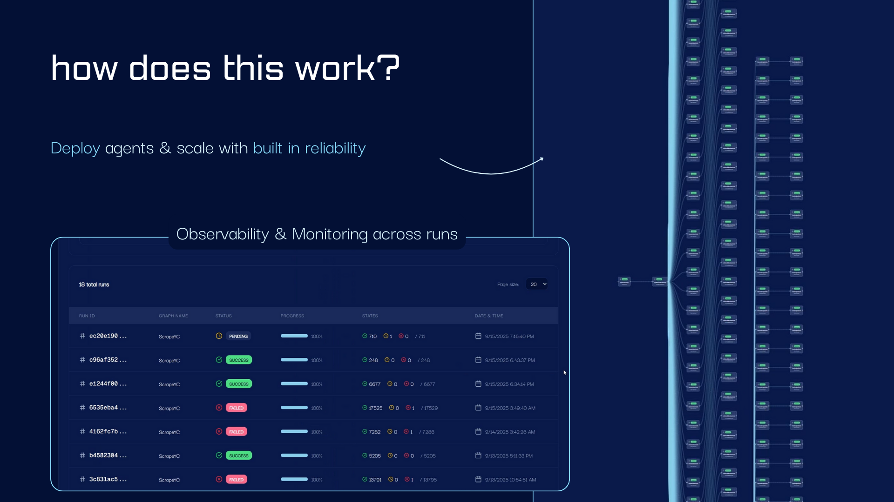
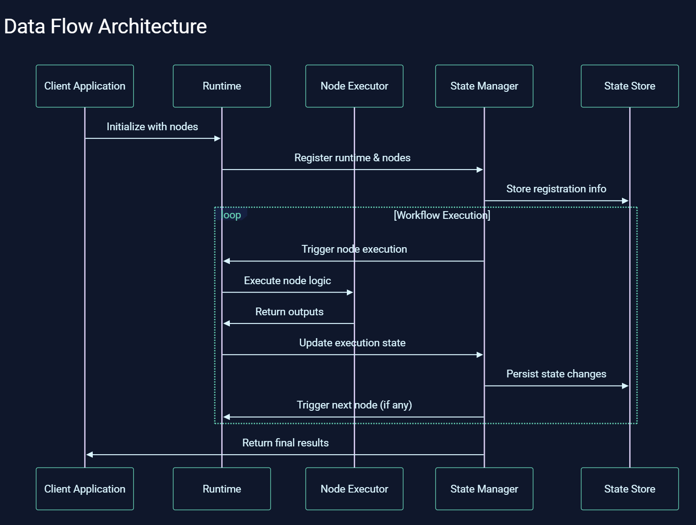
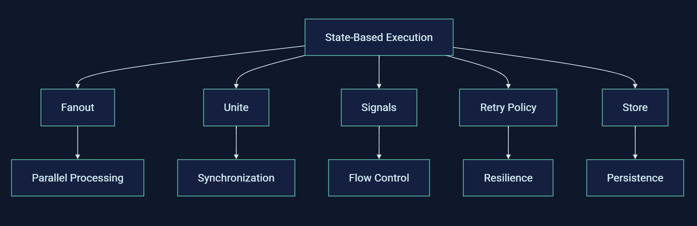

  
  
  
  
  
  
  
  

---

# Exosphere: Reliability Runtime for AI Agents

**Exosphere** is a lightweight runtime to make AI agents resilient to failure and infinite scaling across distributed compute. With a few changes to your existing agent code, take your agent from demo to deployment.

## Why Exosphere?

Exosphere provides a powerful foundation for building and orchestrating AI applications with these key capabilities:

| Feature | Description |
|---------|-------------|
| [**Lightweight Runtime**](https://docs.exosphere.host/exosphere/architecture) | Execute workflows reliably with minimal overhead across distributed infrastructure using a state-based execution model. |
| [**Inbuilt Failure Handling**](https://docs.exosphere.host/exosphere/retry-policy) | Built-in retry policies with exponential backoff and jitter strategies for resilient, production-grade execution. |
| [**Infinite Parallel Agents**](https://docs.exosphere.host/exosphere/fanout) | Scale to unlimited parallel agents with automatic load distribution and dynamic fanout at runtime. |
| [**Dynamic Execution Graphs**](https://docs.exosphere.host/exosphere/concepts) | Durable execution designed for agentic flows with node-based control of execution. |
| [**Native State Persistence**](https://docs.exosphere.host/exosphere/store) | Persist workflow state across restarts and failures with graph-level key-value storage. |
| [**Observability**](https://docs.exosphere.host/exosphere/dashboard) | Visual monitoring, debugging, and management of workflows with real-time execution tracking. |

Whether you're building data pipelines, AI agents, or complex workflow orchestrations, Exosphere provides the infrastructure backbone to make your AI applications production-ready and scalable.

---

## Run Your First Agent

| Step | Description |
|------|-------------|
| [**Getting Started**](https://docs.exosphere.host/getting-started) | Get the Exosphere State Manager and Dashboard running locally for development. |
| [**Run Your First Node**](https://docs.exosphere.host/exosphere/register-node) | Create your first node and register it with the Exosphere runtime. |
| [**Trigger Agent**](https://docs.exosphere.host/exosphere/trigger-graph) | Learn how to trigger your agent workflows and manage execution flows. |
| [**Deploy and Monitor**](https://docs.exosphere.host/exosphere/dashboard) | Deploy your agents and monitor their execution with the visual dashboard. |

---

## Architecture Overview

Exosphere is built on a flexible, node-based architecture that makes it easy to create complex workflows:

### Core Components

| Component | Description |
|-----------|-------------|
| **Nodes** | Atomic, reusable units of work that can be AI agents, API calls, data processors, or any custom logic |
| **Runtime** | The execution environment that manages and orchestrates your nodes |
| **State Manager** | Handles persistent state across workflow executions |
| **Dashboard** | Visual interface for monitoring and managing workflows |
| **Graphs** | Define the flow and dependencies between nodes |

### Key Concepts

| Concept | Description |
|---------|-------------|
| **Fanout** | Distribute work across multiple parallel instances of a node |
| **Unite** | Combine results from multiple parallel executions |
| **Signals** | Inter-node communication and event handling |
| **Retry Policy** | Configurable failure handling and recovery |
| **Store** | Persistent storage for workflow state and data |
| **Triggers** | Automatic scheduling with cron expressions |

---

## Resources

| Resource | Notes |
|----------|-------------|
| [**Getting Started Guide**](https://docs.exosphere.host/getting-started) | Complete walkthrough for new users |
| [**Docker Compose Setup**](https://docs.exosphere.host/docker-compose-setup) | Run Exosphere locally in minutes |
| [**Architecture Guide**](https://docs.exosphere.host/exosphere/architecture) | Understand core concepts like fanout and unite |
| [**YouTube Walkthroughs**](https://www.youtube.com/@exospherehost) | Step-by-step demos on Exosphere with sample code |
| [**Featured Projects**](https://github.com/exospherehost/exosphereprojects) | Templates on common projects, pull and run |

### Community and Support

| Resource | Description |
|----------|-------------|
| [**Official Documentation**](https://docs.exosphere.host) | Complete reference and tutorials |
| [**Discord Community**](https://discord.com/invite/zT92CAgvkj) | Get help and connect with other developers |
| [**GitHub Issues**](https://github.com/exospherehost/exospherehost/issues) | Report bugs and request features |
| [**PyPI Package**](https://pypi.org/project/exospherehost/) | Latest stable releases |

---

## Open Source Commitment

We believe that humanity would not have been able to achieve the level of innovation and progress we have today without the support of open source and community. We want to be a part of this movement.

Please feel free to reach out to us at [nivedit@exosphere.host](mailto:nivedit@exosphere.host). Let's push the boundaries of possibilities for humanity together.

---

## Release Cycle and Roadmap

Exosphere follows a predictable, calendar-based release process:

| Aspect | Description |
|--------|-------------|
| **Monthly Releases** | A new stable version ships at the end of every month |
| **Issue and PR Labelling** | Work intended for a release is tagged `YYYY:Mon` (e.g., `2026:Jan`). Filter by this label in GitHub to see exactly what is planned |
| **Living Roadmap** | The collection of items carrying the current month's label is our public roadmap. Follow along in GitHub Projects to track progress in real time |

---

## Contributing

We welcome community contributions. For guidelines, refer to our [CONTRIBUTING.md](https://github.com/exospherehost/exospherehost/blob/main/CONTRIBUTING.md).

Thanks to our awesome contributors!

