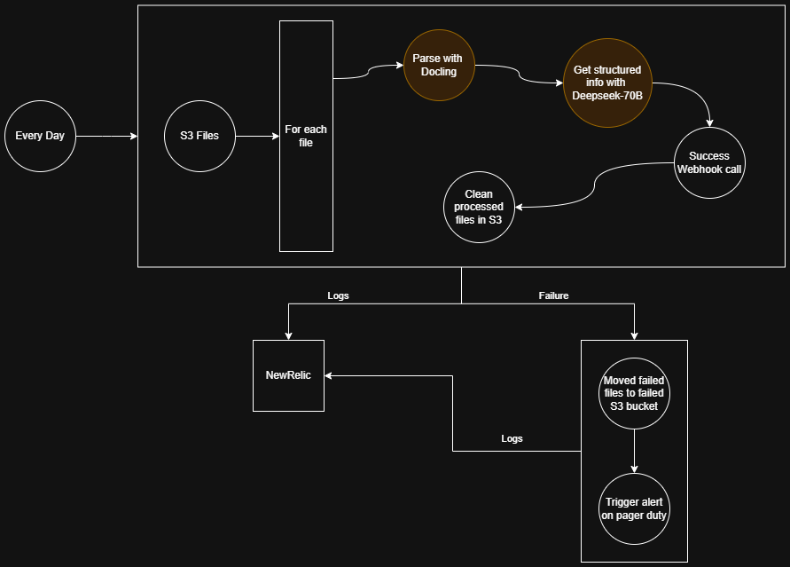

# ExosphereHost


[](https://github.com/exospherehost/exospherehost)
[](LICENSE.md)
[](https://www.python.org/downloads/)
[](https://discord.gg/JzCT6HRN)

> **Our Vision:** We are building a world where creators and innovators can fully dedicate themselves to crafting extraordinary products and services, unburdened by the complexities of the underlying infrastructure. We foresee a future where intelligent systems seamlessly operate behind the scenes, tackling intricate, high-scale challenges with immense computational demands and vast data movements.

**ExosphereHost** is an open-source infrastructure layer for background AI workflows and agents that is robust, affordable, and effortless to use, empowering the scalable solutions and transformative tasks of today, tomorrow, and beyond.

## 🚀 Quick Start

### Prerequisites
- Python 3.12+
- Docker (optional, for local development)
- UV package manager (recommended)

### Installation

#### Using Python SDK
```bash
pip install exospherehost
```

#### Clone Repository
```bash
git clone https://github.com/exospherehost/exospherehost.git
cd exospherehost
```

### Environment Setup
```bash
export EXOSPHERE_STATE_MANAGER_URI="your-state-manager-uri"
export EXOSPHERE_API_KEY="your-api-key"
```

## 🏗️ Architecture Overview

ExosphereHost consists of several key components:

- **🛰️ Satellites**: Pre-implemented serverless functions optimized for AI workflows
- **🌌 Clusters**: Collections of satellites working together to achieve specific goals
- **🔄 Orbit**: Container runtime for managing satellite lifecycles
- **🖥️ API Server**: RESTful API interface for managing projects, users, and workflows
- **📊 State Manager**: Distributed state management for workflow coordination
- **🎯 Python SDK**: Developer-friendly SDK for building distributed AI applications

## 🛰️ Core Concepts

### Satellites
Satellites are the core building blocks for ExosphereHost. They are lego blocks designed for specific purposes that can be connected together to create complex systems in minutes without worrying about the underlying infrastructure.

**Key Properties:**
- ✅ Idempotent and stateless
- 🏷️ Unique identifier format: `satellite/project-name/satellite-name`
- ⚙️ Configurable via `config` parameter
- 🔗 Completely independent of other satellites
- 📋 Return structured list of objects
- 📈 Built-in status tracking and retry mechanisms

**Cost Optimization:** Our in-house optimization can lead to **50-75% cost savings** on LLMs like DeepSeek R1 70B, Gemma 3 27B, etc.

### Clusters
A Cluster is a collection of satellites connected together to form a complete workflow.

**Key Properties:**
- 🔗 Connected satellites forming a system
- 🏷️ Unique identifier format: `cluster/project-name/cluster-name`
- ⏱️ SLA-based pricing: `6h`, `12h`, `24h` (higher SLA = lower cost)
- 🎯 Multiple trigger types: `cron`, `api-call`, events
- 📊 Configurable logging and failure handling
- 🔄 Built-in retry and error recovery

## 📋 Example: Financial Report Processing

Here's a complete example of processing quarterly financial reports using our cluster API:

<a href="https://www.youtube.com/watch?v=tfVYXpjyGqQ" target="_blank">
  
</a>



```yaml
# define the version of the exosphere apis
version: 0.0.1b

# using cluster api to create the cluster
cluster: 
    # maximum allowed to compute the cluster
    # define the sla of the cluster (6h, 12h, 24h)
    sla: 6h 

    # define the name and description of the cluster for better understanding (optional)
    title: Structured JSON from Quarterly Financial Reports
    description: This cluster will take a list of PDF files from S3 and return a structured JSON output.

    # define the identifier of the cluster (project-name/cluster-name)
    identifier: aikin/strucutred-pdfs

    # trigger for the cluster
    trigger: 
        cron: "0 0 * * *"

    # define retries for each satellite, default is 5
    retries: 3

    # define the secrets for the cluster, these are stored in a secure vault and only accessible by allowed satellites in this cluster
    # still be sure to have minimum required permissions for each secret to avoid any security issues
    secrets:
        - AWS_ACCESS_KEY: "your-aws-access-key"
        - AWS_SECRET_KEY: "your-aws-secret-key"
        - API_BEARER_TOKEN: "your-api-bearer-token"
        - NEW_RELIC_ACCOUNT_ID: "your-new-relic-account-id"
        - NEW_RELIC_API_KEY: "your-new-relic-api-key"
        - NEW_RELIC_APPLICATION_ID: "your-new-relic-application-id"
        - FAILURE_S3_AWS_ACCESS_KEY: "your-failure-s3-aws-access-key"
        - FAILURE_S3_AWS_SECRET_KEY: "your-failure-s3-aws-secret-key"
  
    # satellites in order to execute, each satellite returns a list of objects hence computational graph is formed and is executed in parallel.
    satellites:
        - name: Get files from S3
          uses: satellite/exospherehost/get-files-from-s3
          identifier: get-files-from-s3
          config:
            bucket: aikin-financial-reports
            prefix: sec
            recursive: true
            extension: pdf
            secrets:
                - AWS_ACCESS_KEY: ${{ secrets.AWS_ACCESS_KEY }}
                - AWS_SECRET_KEY: ${{ secrets.AWS_SECRET_KEY }}
        - name: Extract text from PDF
          uses: satellite/exospherehost/parse-pdf-with-docling
          identifier: parse-pdf-with-docling
          config: 
            language: en
            output-format: markdown-string
            extract-images: false
        - name: Get structured json from markdown using DeepSeek
          uses: satellite/exospherehost/deepseek-r1-distrill-llama-70b
          identifier: deepseek-r1-distrill-llama-70b
          retries: 5
          config:
            temperature: 0.5
            max-tokens: 1024
            output-format: json
            output-schema: |
                {
                    "company": string, 
                    "quarter": string,
                    "year": string,
                    "revenue": number,
                    "net-income": number,
                    "gross-profit": number,
                    "operating-income": number,
                    "net-income-margin": number,
                    "gross-profit-margin": number,
                    "operating-income-margin": number,
                }
          input:
            prompt: |
                Parse the following quarterly financial report and return a structured json output as defined in the output-schema, report text is provided below:
                ${{satellites.parse-pdf-with-docling.output}}
        - name: Call Webhook to send the structured json to Aikin API
          uses: satellite/exospherehost/call-webhook
          identifier: call-webhook
          config:
            url: https://api.aikin.com/v1/financial-reports
            method: POST
            headers:
              - Authorization: Bearer ${{ secrets.API_BEARER_TOKEN }}
            body:
              - data: ${{satellites.deepseek-r1-distrill-llama-70b.output}}
                file-path: $${{satellites.get-files-from-s3.output.file-path}}
        - name: Delete success file from S3
          uses: satellite/exospherehost/delete-file-from-s3
          identifier: delete-file-from-s3
          config:
            bucket: aikin-financial-reports
            file-path: $${{satellites.get-files-from-s3.output.file-path}}
            secrets:
                - AWS_ACCESS_KEY: ${{ secrets.AWS_ACCESS_KEY }}
                - AWS_SECRET_KEY: ${{ secrets.AWS_SECRET_KEY }}


    # define steps to handle logs for this cluster
    logs:
        satellites:
            - name: Send logs to NewRelic
              uses: satellite/exospherehost/send-logs-to-new-relic
              identifier: send-logs-to-new-relic
              config:
                account-id: ${{ secrets.NEW_RELIC_ACCOUNT_ID }}
                api-key: ${{ secrets.NEW_RELIC_API_KEY }}
                application-id: ${{ secrets.NEW_RELIC_APPLICATION_ID }}
                log-level: info

    # define steps to handle failure for this cluster
    failure:
        # run from failed steps from this satellite
        from: parse-pdf-with-docling
        satellites:
            - name: Move to failure bucket
              uses: satellite/exospherehost/move-to-s3
              identifier: move-to-failure-bucket
              config:
                origin-source: s3
                origin-bucket: aikin-financial-reports-failure
                origin-file-path: $${{satellites.get-files-from-s3.output.file-path}}
                destination-source: s3
                destination-bucket: aikin-financial-reports-failure
                destination-file-path: failed/quaterly-financial-reports/$${{satellites.get-files-from-s3.output.file-name}}
                secrets:
                    - ORIGIN_AWS_ACCESS_KEY: ${{ secrets.AWS_ACCESS_KEY }}
                    - ORIGIN_AWS_SECRET_KEY: ${{ secrets.AWS_SECRET_KEY }}
                    - DESTINATION_AWS_ACCESS_KEY: ${{ secrets.FAILURE_S3_AWS_ACCESS_KEY }}
                    - DESTINATION_AWS_SECRET_KEY: ${{ secrets.FAILURE_S3_AWS_SECRET_KEY }}
            - name: Send failure notification on PagerDuty
              uses: satellite/exospherehost/send-pagerduty-alert
              identifier: send-pagerduty-alert
              config:
                pagerduty-api-key: ${{ secrets.PAGERDUTY_API_KEY }}
                pagerduty-service-id: ${{ secrets.PAGERDUTY_SERVICE_ID }}
              input:
                  message: |
                    Cluster ${{cluster.identifier}} failed at ${{cluster.trigger}} for file $${{satellites.get-files-from-s3.output.file-path}}  with error ${{satellites.get-files-from-s3.output.error}}, file has been moved to failure bucket with path $${{satellites.move-to-failure-bucket.output.file-uri}}
```

## 🐍 Python SDK Usage

Create distributed AI workflows using our Python SDK:

```python
from exospherehost import Runtime, BaseNode
from pydantic import BaseModel

class DataProcessorNode(BaseNode):
    class Inputs(BaseModel):
        name: str
        data: str

    class Outputs(BaseModel):
        message: str
        processed_data: str

    async def execute(self) -> Outputs:
        print(f"Processing data for: {self.inputs.name}")
        processed_data = f"completed:{self.inputs.data}"
        return self.Outputs(
            message="success",
            processed_data=processed_data
        )

# Initialize and start the runtime
Runtime(
    namespace="MyProject",
    name="DataProcessor",
    nodes=[DataProcessorNode]
).start()
```

## 🏗️ Repository Structure

```
exospherehost/
├── 📁 api-server/          # FastAPI-based REST API server
├── 📁 python-sdk/          # Official Python SDK
├── 📁 state-manager/       # Distributed state management
├── 📁 exosphere-runtimes/  # Runtime environments for satellites
├── 📁 landing-page/        # Next.js landing page
├── 📁 docs/               # MkDocs documentation
├── 📁 k8s/               # Kubernetes deployment configs
├── 📁 assets/            # Images and static assets
├── 📁 .github/           # GitHub workflows and templates
└── 📄 README.md          # This file
```

## 🛠️ Development Setup

### Local Development Environment

1. **Clone the repository:**
   ```bash
   git clone https://github.com/exospherehost/exospherehost.git
   cd exospherehost
   ```

2. **Set up API Server:**
   ```bash
   cd api-server
   uv sync
   cp .env.example .env  # Configure your environment
   uv run python run.py
   ```

3. **Set up State Manager:**
   ```bash
   cd state-manager
   uv sync
   uv run python run.py
   ```

4. **Set up Landing Page:**
   ```bash
   cd landing-page
   npm install
   npm run dev
   ```

5. **Build Documentation:**
   ```bash
   cd docs
   uv sync
   uv run mkdocs serve
   ```

### Docker Development

```bash
# Start all services
docker-compose up -d

# View logs
docker-compose logs -f

# Stop services
docker-compose down
```

## 📚 Documentation

### 🌐 Online Documentation
- **Main Documentation**: [https://docs.exosphere.host](https://docs.exosphere.host)
- **API Reference**: [https://docs.exosphere.host/api-server/swagger](https://docs.exosphere.host/api-server/swagger)
- **Python SDK**: [https://docs.exosphere.host/python-sdk](https://docs.exosphere.host/python-sdk)

### 🏠 Local Documentation
Build and serve documentation locally:

1. **Install UV**: Follow the official instructions [here](https://docs.astral.sh/uv/#installation)
2. **Navigate to docs folder**: `cd docs`
3. **Install dependencies**: `uv sync`
4. **Serve documentation**: `uv run mkdocs serve`

The documentation will be available at `http://localhost:8000`

### 📝 Contributing to Documentation
We encourage contributions to the documentation! Simply:
1. Fork the repository
2. Make your changes in the `docs/docs/` directory
3. Submit a pull request with the `documentation` label

## 🤝 Contributing

We welcome community contributions! Here's how you can help:

### 🐛 Reporting Issues
- Check existing [issues](https://github.com/exospherehost/exospherehost/issues)
- Create a new issue with detailed description
- Include steps to reproduce for bugs

### 🔧 Development Contributions
1. **Fork** the repository
2. **Create** a feature branch: `git checkout -b feature/amazing-feature`
3. **Commit** your changes: `git commit -m 'Add amazing feature'`
4. **Push** to the branch: `git push origin feature/amazing-feature`
5. **Open** a Pull Request

### 📋 Contribution Guidelines
- Follow our [Code of Conduct](CODE_OF_CONDUCT.md)
- Read the [Contributing Guidelines](CONTRIBUTING.md)
- Ensure tests pass and code is properly formatted
- Update documentation for new features

## 🌟 Open Source Commitment

We believe in the power of open source and are committed to:

1. **🔓 Open Source Everything**: We're open-sourcing the majority of our codebase and welcome contributions from the community
2. **💰 Profit Sharing**: A portion of our profits goes back to open source projects and communities
3. **🎓 Student Programs**: We collaborate with open source student programs to mentor the next generation of contributors

## 🛡️ Security

We take security seriously. Please refer to our [Security Policy](SECURITY.md) for reporting vulnerabilities.

## 📄 License

This project is licensed under the **Elastic License 2.0 (ELv2)**. See the [LICENSE.md](LICENSE.md) file for details.

The Python SDK is licensed under the **MIT License**.

## 📞 Support & Community

- **📧 Email**: [nivedit@exosphere.host](mailto:nivedit@exosphere.host)
- **💬 Discord**: [Join our community](https://discord.gg/JzCT6HRN)
- **🐦 Twitter**: [@exospherehost](https://x.com/exospherehost)
- **💼 LinkedIn**: [exospherehost](https://www.linkedin.com/company/exospherehost/)
- **📺 YouTube**: [@exospherehost](https://www.youtube.com/@exospherehost)
- **📸 Instagram**: [@exospherehost](https://www.instagram.com/exospherehost/)

## 👥 Contributors

Thanks to all the amazing contributors helping us simplify infrastructure for AI workflows and agents!


## ⭐ Star History

<a href="https://www.star-history.com/#exospherehost/exospherehost&Date" target="_blank">
 <picture>
   <source media="(prefers-color-scheme: dark)" srcset="https://api.star-history.com/svg?repos=exospherehost/exospherehost&type=Date&theme=dark" />
   <source media="(prefers-color-scheme: light)" srcset="https://api.star-history.com/svg?repos=exospherehost/exospherehost&type=Date" />
   
 </picture>
</a>

---

**Let's push the boundaries of possibilities for humanity together! 🚀**
