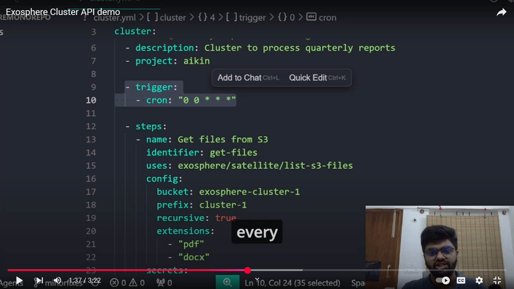

> Our vision is a world where creators and innovators can fully dedicate themselves to crafting extraordinary products and services, unburdened by the complexities of the underlying infrastructure. We foresee a future where intelligent systems seamlessly operate behind the scenes, tackling intricate, high-scale challenges with immense computational demands and vast data movements.

To realize this, we are pioneering an open-source infrastructure layer for background AI workflows and agents that is robust, affordable, and effortless to use, empowering the scalable solutions and transformative tasks of today, tomorrow, and beyond.

## Core Concepts

To have an intution of the first version of the platform, we would highly recommend watching the video below, this explains using our cluster apis with YML input, however we are working on more modalities like pythonic control systems.

### Satellite

Satellites are core for exosphere, think of a satellite like lego blocks designed for a specific purpose, you can connect them together to create a much complex systems in matter of minutes without worrying about the underlying infrastructure.

Esentially they are a kind of pre-implemented serverless functions highly optimized for workflows and high volume batch processing, optimized for cost, reliability, developer velocity and ease of use.

Each of these satellites must satisfy the following properties:

1. Should be idempotent and stateless.
2. Should have a unique identifier of the format `satellite/unique-project-name/satellite-name`, example: `satellite/exospherehost/deepseek-r1-distrill-llama-70b`
3. Should be take a `config` parameter as an `object` to control or modify the behaviour.
4.

## Documentation

For more information, please refer to our [documentation](https://docs.exosphere.host).

### Steps to build the Documentation locally

1. Install UV: Follow the offical instructions [here](https://docs.astral.sh/uv/#installation).
2. Clone this repository, use command `git clone https://github.com/exospherehost/exospherehost.git`
3. Install dependencies by navigating to `docs` folder and executing `uv sync`
4. Use the command `uv run mkdocs serve` while `docs` folder being your working path.

### Contribute to Documentation

We encourage contributions to the documentation page, you can simply add a new PR with the `documentation` label.

## Contributing

We welcome community contributions. For guidelines, refer to our [CONTRIBUTING.md](/CONTRIBUTING.md).

