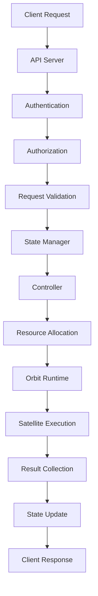

# Architecture

This page explains the architecture, working principles, and implementation details of ExosphereHost's distributed AI workflow infrastructure.


## 🏗️ System Overview

ExosphereHost is designed as a distributed, microservices-based platform that orchestrates AI workflows through a collection of specialized components. The architecture prioritizes scalability, reliability, and cost optimization while maintaining simplicity for developers.

### Core Design Principles

- **🔄 Distributed by Design**: Every component can scale horizontally
- **🛡️ Fault Tolerant**: Built-in retry mechanisms and failure recovery
- **💰 Cost Optimized**: Intelligent resource allocation and batch processing
- **🔒 Security First**: End-to-end encryption and secure secret management
- **📊 Observable**: Comprehensive monitoring and logging
- **🔧 Developer Friendly**: Simple APIs and intuitive abstractions

## 🏛️ Component Architecture

### API Server
**Role**: Public interface and gateway to the ExosphereHost platform

**Responsibilities**:
- **🔐 Authentication & Authorization**: JWT-based auth with RBAC
- **📊 Request Routing**: Intelligent routing to appropriate services
- **⚡ Rate Limiting**: Prevent abuse and ensure fair usage
- **📝 Request Logging**: Comprehensive audit trails
- **🔄 Load Balancing**: Distribute requests across service instances

**Technology Stack**:
- **Framework**: FastAPI with async/await
- **Database**: MongoDB with Beanie ODM
- **Authentication**: JWT tokens with RS256 signing
- **Middleware**: Custom middleware for logging, CORS, and error handling

**Key Features**:
```python
# Example API endpoint structure
@router.post("/clusters/")
async def create_cluster(
    cluster_config: ClusterConfig,
    current_user: User = Depends(get_current_user),
    project: Project = Depends(get_current_project)
):
    # Validate permissions
    # Submit to controller
    # Return execution tracking info
```

### State Manager
**Role**: Central coordination hub for workflow orchestration

**Responsibilities**:
- **🔄 Workflow Orchestration**: Manage satellite execution flow
- **📊 State Persistence**: Reliable state storage and recovery
- **🔗 Dependency Resolution**: Handle complex satellite dependencies
- **⚡ Real-time Updates**: WebSocket-based status broadcasting
- **🔄 Retry Logic**: Configurable retry policies and backoff strategies
- **📈 Resource Allocation**: Optimal compute resource distribution

**Architecture**:
```
State Manager
├── Execution Engine
│   ├── Dependency Resolver
│   ├── Scheduler
│   └── Resource Allocator
├── State Store
│   ├── Redis (Fast access)
│   └── PostgreSQL (Persistence)
├── Message Broker
│   ├── Event Publisher
│   └── Status Broadcaster
└── API Interface
    ├── REST Endpoints
    └── WebSocket Handlers
```

**Data Flow**:
1. **Cluster Submission** → Dependency analysis → Execution planning
2. **Resource Allocation** → Satellite scheduling → Progress tracking
3. **State Updates** → Real-time broadcasting → Client notifications
4. **Completion Handling** → Result aggregation → Cleanup

### Controller (Orbit)
**Role**: Intelligent workload orchestrator and resource manager

**Responsibilities**:
- **📅 Intelligent Scheduling**: Optimize satellite execution timing
- **🎯 Resource Management**: Manage GPU, CPU, and memory allocation
- **🔄 Auto-scaling**: Dynamic scaling based on workload
- **📊 Performance Optimization**: SLA-based cost optimization
- **🛡️ Fault Handling**: Automatic failure detection and recovery
- **📈 Capacity Planning**: Predictive resource allocation

**Scheduling Algorithm**:
```python
class SchedulingEngine:
    def schedule_satellites(self, cluster: Cluster) -> ExecutionPlan:
        # 1. Analyze dependencies
        dependency_graph = self.build_dependency_graph(cluster.satellites)
        
        # 2. Optimize for SLA and cost
        execution_plan = self.optimize_execution_plan(
            dependency_graph, 
            cluster.sla,
            available_resources
        )
        
        # 3. Allocate resources
        self.allocate_resources(execution_plan)
        
        return execution_plan
```

### Orbit Runtime
**Role**: Containerized execution environment for satellites

**Responsibilities**:
- **🐳 Container Management**: Docker-based satellite execution
- **🔒 Security Isolation**: Secure execution sandboxes
- **📊 Resource Monitoring**: Real-time resource usage tracking
- **🔄 Lifecycle Management**: Start, monitor, and cleanup satellites
- **📝 Log Collection**: Centralized logging and error reporting

**Container Architecture**:
```dockerfile
# Example Orbit container
FROM python:3.12-slim
WORKDIR /satellite
COPY requirements.txt .
RUN pip install -r requirements.txt
COPY . .
ENTRYPOINT ["python", "satellite_runner.py"]
```

**Security Features**:
- **🔒 Network Isolation**: Restricted network access
- **📁 File System Isolation**: Read-only root filesystem
- **👤 User Isolation**: Non-root user execution
- **🔐 Secret Injection**: Secure secret management
- **📊 Resource Limits**: CPU/memory constraints

### Infrastructure Manager
**Role**: Dynamic infrastructure provisioning and management

**Responsibilities**:
- **☁️ Cloud Resource Management**: Multi-cloud resource provisioning
- **📈 Auto-scaling**: Dynamic scaling based on demand
- **💰 Cost Optimization**: Spot instance management and right-sizing
- **🔄 Health Monitoring**: Infrastructure health checks
- **🛡️ Disaster Recovery**: Backup and recovery procedures

**Multi-Cloud Support**:
```yaml
# Infrastructure configuration
providers:
  aws:
    regions: [us-east-1, us-west-2, eu-west-1]
    instance_types: [t3.micro, t3.small, g4dn.xlarge]
    spot_instances: true
  gcp:
    regions: [us-central1, europe-west1]
    machine_types: [e2-micro, e2-standard-2, n1-standard-4]
  azure:
    regions: [eastus, westeurope]
    vm_sizes: [Standard_B1s, Standard_D2s_v3]
```

## 🔄 Data Flow Architecture

### Request Processing Flow



### Satellite Execution Flow

1. **Submission Phase**:
   - Client submits cluster configuration
   - API Server validates and authenticates
   - State Manager creates execution record

2. **Planning Phase**:
   - Controller analyzes dependencies
   - Builds optimal execution plan
   - Allocates required resources

3. **Execution Phase**:
   - Orbit containers are launched
   - Satellites execute in parallel where possible
   - Real-time status updates are broadcast

4. **Completion Phase**:
   - Results are collected and aggregated
   - State is persisted for audit
   - Resources are cleaned up

### State Management

**State Types**:
- **Transient State**: In-memory caches (Redis)
- **Persistent State**: Database records (PostgreSQL/MongoDB)
- **Execution State**: Real-time status and progress
- **Result State**: Satellite outputs and intermediate results

**State Consistency**:
```python
class StateManager:
    async def update_satellite_state(
        self, 
        satellite_id: str, 
        state: SatelliteState
    ):
        async with self.transaction():
            # Update persistent storage
            await self.db.update_satellite(satellite_id, state)
            
            # Update cache
            await self.cache.set(f"satellite:{satellite_id}", state)
            
            # Broadcast update
            await self.broadcast_state_change(satellite_id, state)
```

## 🔒 Security Architecture

### Authentication & Authorization

**Multi-layered Security**:
1. **API Gateway**: Rate limiting and DDoS protection
2. **JWT Authentication**: Stateless token-based auth
3. **RBAC Authorization**: Fine-grained permissions
4. **Service-to-Service**: mTLS for internal communication

**Permission Model**:
```yaml
roles:
  super_admin:
    - project:*
    - user:*
    - billing:*
  
  project_admin:
    - project:read,write,delete
    - user:invite,remove
    - cluster:*
    - satellite:*
  
  developer:
    - cluster:create,read,update
    - satellite:execute,read
    - logs:read
  
  viewer:
    - cluster:read
    - satellite:read
    - logs:read
```

### Data Protection

**Encryption**:
- **At Rest**: AES-256 database encryption
- **In Transit**: TLS 1.3 for all communications
- **Application Level**: Field-level encryption for secrets

**Secret Management**:
```python
class SecretManager:
    def encrypt_secret(self, value: str, project_id: str) -> str:
        key = self.get_project_key(project_id)
        return self.encrypt(value, key)
    
    def decrypt_secret(self, encrypted: str, project_id: str) -> str:
        key = self.get_project_key(project_id)
        return self.decrypt(encrypted, key)
```

## 📊 Monitoring & Observability

### Metrics Collection

**System Metrics**:
- **Performance**: Request latency, throughput, error rates
- **Resource Usage**: CPU, memory, storage utilization
- **Business Metrics**: Execution costs, SLA compliance

**Custom Metrics**:
```python
# Example metrics collection
@metrics.timer("satellite.execution.duration")
@metrics.counter("satellite.execution.count")
async def execute_satellite(satellite_config: SatelliteConfig):
    start_time = time.time()
    try:
        result = await satellite.execute()
        metrics.increment("satellite.execution.success")
        return result
    except Exception as e:
        metrics.increment("satellite.execution.failure")
        raise
    finally:
        duration = time.time() - start_time
        metrics.record("satellite.execution.duration", duration)
```

### Distributed Tracing

**Trace Propagation**:
- **OpenTelemetry**: Standard tracing protocol
- **Jaeger**: Distributed tracing backend
- **Correlation IDs**: Request tracking across services

**Example Trace**:
```
Trace: cluster-execution-abc123
├── api-server: validate-request (2ms)
├── state-manager: create-execution (5ms)
├── controller: plan-execution (15ms)
└── orbit: satellite-execution (2000ms)
    ├── satellite-1: data-ingestion (500ms)
    ├── satellite-2: data-processing (1200ms)
    └── satellite-3: result-storage (300ms)
```

## 🚀 Scalability Design

### Horizontal Scaling

**Stateless Services**:
- API Server: Multiple instances behind load balancer
- Controller: Leader election for coordination
- Orbit Runtime: Auto-scaling based on queue depth

**Data Layer Scaling**:
```yaml
# Database scaling strategy
mongodb:
  replica_set: 3 nodes
  sharding: by project_id
  read_preference: secondary_preferred

redis:
  cluster_mode: enabled
  nodes: 6 (3 masters, 3 replicas)
  
postgresql:
  master_slave: enabled
  connection_pooling: pgbouncer
```

### Performance Optimization

**Caching Strategy**:
- **L1 Cache**: In-memory application cache
- **L2 Cache**: Redis distributed cache
- **L3 Cache**: CDN for static assets

**Database Optimization**:
- **Indexing**: Optimized indexes for common queries
- **Partitioning**: Time-based partitioning for logs
- **Connection Pooling**: Efficient database connections

## 🔧 Deployment Architecture

### Container Orchestration

**Kubernetes Deployment**:
```yaml
apiVersion: apps/v1
kind: Deployment
metadata:
  name: api-server
spec:
  replicas: 3
  strategy:
    type: RollingUpdate
    rollingUpdate:
      maxSurge: 1
      maxUnavailable: 0
  template:
    spec:
      containers:
      - name: api-server
        image: exosphere/api-server:latest
        resources:
          requests:
            cpu: 100m
            memory: 256Mi
          limits:
            cpu: 500m
            memory: 512Mi
```

### Multi-Environment Setup

**Environment Isolation**:
- **Development**: Single-node setup with mock services
- **Staging**: Multi-node setup with production-like data
- **Production**: Full HA setup with disaster recovery

**Configuration Management**:
```yaml
# Environment-specific configs
environments:
  development:
    replicas: 1
    resources: minimal
    monitoring: basic
  
  production:
    replicas: 3
    resources: optimized
    monitoring: comprehensive
    backup: enabled
```

## 📈 Future Architecture Considerations

### Planned Enhancements

1. **🔄 Event Sourcing**: Complete audit trail with event replay
2. **🤖 AI-Powered Optimization**: ML-based resource allocation
3. **🌐 Edge Computing**: Distributed satellite execution
4. **📊 Advanced Analytics**: Real-time workflow analytics
5. **🔗 Blockchain Integration**: Decentralized workflow verification

### Scalability Roadmap

- **Phase 1**: Support for 1K concurrent executions
- **Phase 2**: Support for 10K concurrent executions
- **Phase 3**: Support for 100K+ concurrent executions
- **Phase 4**: Global multi-region deployment

---

**This architecture enables ExosphereHost to provide reliable, scalable, and cost-effective AI workflow infrastructure while maintaining simplicity for developers. 🚀**