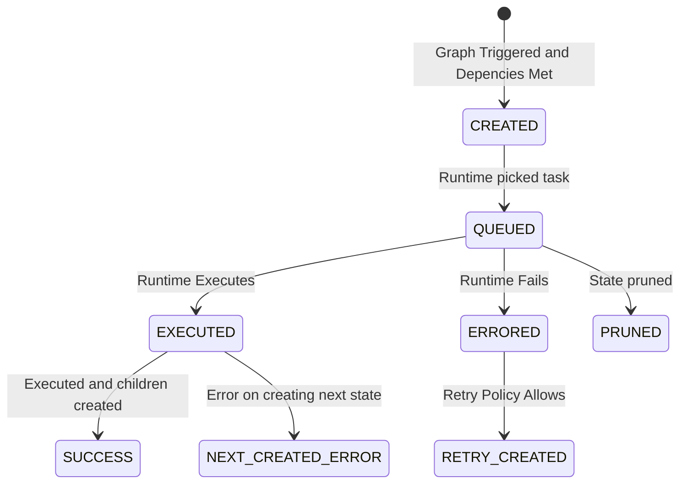
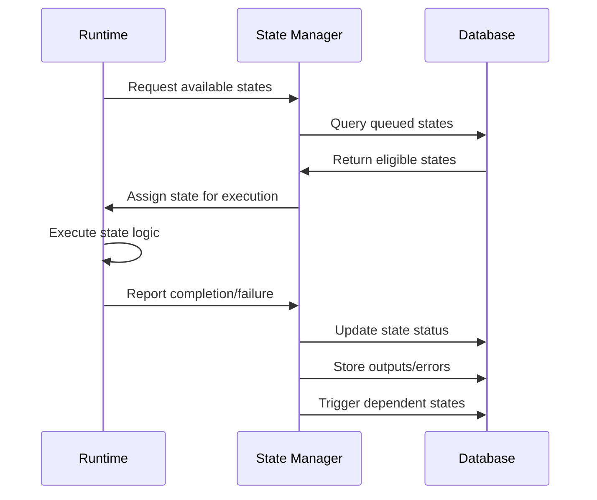

# Exosphere Architecture

This document provides a comprehensive overview of Exosphere's top-level architecture, focusing on state execution, fanout mechanisms, and the unites keyword for stage unification.

> **📚 Getting Started**: For a complete local setup guide covering both the state manager and dashboard, see our [Local Setup Guide](./local-setup.md).

## Overview

Exosphere is built around a **state-based execution model** where workflows are composed of discrete states that can be executed independently. The architecture consists of several key components:

- **State Manager**: Central orchestrator that manages state lifecycle and transitions
- **Runtimes**: Distributed execution engines that process individual states
- **Graph Templates**: Declarative workflow definitions
- **States**: Individual execution units with inputs, outputs, and metadata

> **📚 Core Concepts**: For a comprehensive overview of Exosphere's unique features, see **[Exosphere Concepts](./concepts.md)**.

## State Execution Model

### State Lifecycle

Each state in Exosphere follows a well-defined lifecycle:

```
CREATED → QUEUED → EXECUTED/ERRORED → SUCCESS
```

1. **CREATED**: State is initialized with inputs and dependencies
2. **QUEUED**: State is ready for execution and waiting for a runtime
3. **EXECUTED**: State finished (with outputs) — terminal for that state
4. **ERRORED**: State failed during executionState and all its dependencies are complete
5. **SUCCESS**: Workflow/branch-level success once all dependent states complete

### State Execution Flow

The following diagram illustrates how states flow through the execution system using the actual StateStatusEnum values:



### Runtime Interaction

States interact with runtimes through a pull-based model:



## Architecture Benefits

### Scalability

- **Horizontal scaling**: Add more runtime instances to handle increased load
- **Parallel processing**: Fanout enables concurrent execution
- **Load distribution**: State manager distributes work across available runtimes

### Fault Tolerance

- **State persistence**: All states are stored in the database
- **Retry mechanisms**: Failed states can be retried automatically
- **Recovery**: Workflows can resume from where they left off

### Flexibility

- **Dynamic fanout**: Nodes can produce variable numbers of outputs
- **Synchronization**: Unites keyword provides precise control over parallel execution
- **Dependency management**: Automatic resolution of complex dependencies

### Observability

- **State tracking**: Complete visibility into execution progress
- **Error handling**: Detailed error information and retry logic
- **Performance monitoring**: Track execution times and resource usage


Exosphere's architecture provides a robust foundation for building distributed, scalable workflows. The combination of state-based execution, fanout mechanisms, and the unites keyword enables complex parallel processing patterns while maintaining simplicity and reliability.

## Next Steps

- **[Exosphere Concepts](./concepts.md)** - Explore Exosphere's core concepts and unique features
- **[Fanout](./fanout.md)** - Learn about parallel execution and dynamic scaling
- **[Unite](./unite.md)** - Understand synchronization of parallel paths
- **[Signals](./signals.md)** - Control workflow execution flow
- **[Retry Policy](./retry-policy.md)** - Build resilient workflows
- **[Store](./store.md)** - Persist data across workflow execution