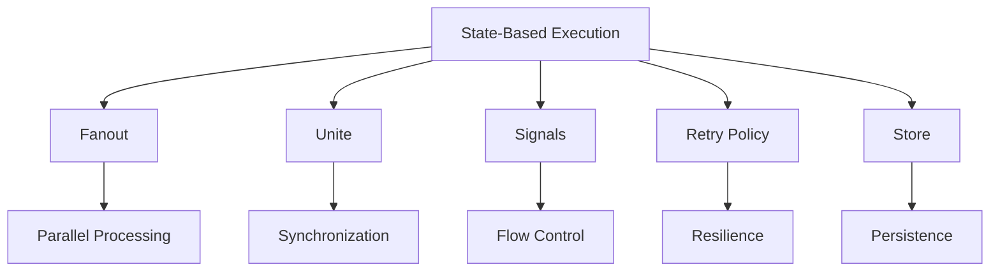

# Exosphere Concepts

Exosphere is built around several core concepts that make it unique in the workflow orchestration space. This page provides an overview of these key features and how they work together.

## Core Concepts Overview

Exosphere's architecture is designed around these fundamental concepts:

## Unique Features

### 1. **State-Based Execution Model**
- **Discrete States**: Each workflow step is a separate, independently executable state
- **Persistent State**: All states are stored in the database for reliability and recovery
- **Independent Execution**: States can be processed by any available runtime instance

### 2. **Dynamic Fanout**
- **Runtime Fanout**: Nodes can produce multiple outputs during execution, creating parallel paths
- **Variable Parallelism**: The number of parallel executions is determined at runtime, not design time
- **Automatic Scaling**: More runtime instances automatically handle increased parallel load

### 3. **Intelligent Unite**
- **Smart Synchronization**: The `unites` keyword synchronizes parallel execution paths
- **State Fingerprinting**: Prevents duplicate unite states for the same parallel branch
- **Flexible Strategies**: Choose between waiting for all success or all completion

### 4. **Signals System**
- **Flow Control**: Nodes can control workflow execution by raising signals
- **Prune Signal**: Terminate execution branches when conditions aren't met
- **ReQueue Signal**: Schedule retries or polling with custom delays

### 5. **Advanced Retry Policies**
- **Multiple Strategies**: Exponential, linear, and fixed backoff with jitter variants
- **Jitter Prevention**: Built-in jitter prevents thundering herd problems
- **Delay Capping**: Configurable maximum delays for predictable behavior

### 6. **Persistent Store**
- **Graph-Level Storage**: Key-value store that persists across the entire workflow execution
- **Runtime Access**: All nodes can read and write to the shared store
- **Automatic Cleanup**: Store data is automatically cleaned up when workflows complete

## How They Work Together

These concepts combine to create a powerful workflow system:

1. **State-based execution** provides the foundation for distributed, reliable processing
2. **Fanout** enables parallel processing and horizontal scaling
3. **Unite** synchronizes parallel paths and enables complex workflow patterns
4. **Signals** give nodes control over execution flow and error handling
5. **Retry policies** ensure resilience against transient failures
6. **Store** provides persistent state across workflow executions

## Benefits

- **Scalability**: Horizontal scaling with automatic load distribution
- **Reliability**: Persistent state management and automatic retry mechanisms
- **Flexibility**: Dynamic parallelism and runtime flow control
- **Observability**: Complete visibility into execution state and progress
- **Developer Experience**: Simple node-based API with powerful orchestration

## Next Steps

Explore each concept in detail:

- **[Fanout](./fanout.md)** - Learn about parallel execution and dynamic scaling
- **[Unite](./unite.md)** - Understand synchronization of parallel paths
- **[Signals](./signals.md)** - Control workflow execution flow
- **[Retry Policy](./retry-policy.md)** - Build resilient workflows
- **[Store](./store.md)** - Persist data across workflow execution 
