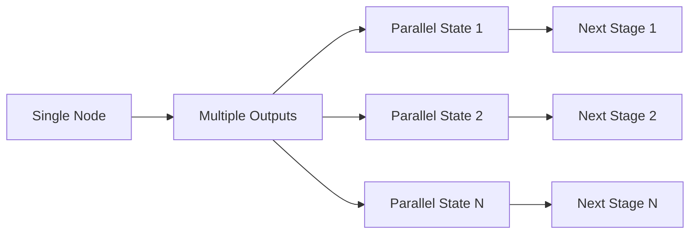

# Fanout

Fanout is Exosphere's mechanism for creating parallel execution paths during workflow execution. It allows nodes to produce multiple outputs, automatically creating parallel states for each output.

## Overview

Fanout enables **dynamic parallelism** where the number of parallel executions is determined at runtime, not at design time. This makes Exosphere uniquely powerful for scenarios where you need to process variable amounts of data or create conditional parallel paths.



## How Fanout Works

### Single vs Multiple Outputs

Exosphere supports two execution patterns:

1. **Single Output**: A state produces one output and continues to the next stage
2. **Multiple Outputs (Fanout)**: A state produces multiple outputs, creating parallel execution paths

### Fanout Execution Flow

When a node returns multiple outputs:

1. **Original state** gets the first output and continues execution
2. **Additional states** are created for each remaining output
3. **All states** are marked as EXECUTED
4. **Next stages** are created for each state independently

## Implementation

### Basic Fanout Example

```python
class DataSplitterNode(BaseNode):
    class Inputs(BaseModel):
        data: str
    
    class Outputs(BaseModel):
        chunk: str
    
    async def execute(self, inputs: Inputs) -> list[Outputs]:
        data = json.loads(inputs.data)
        chunk_size = 100
        
        outputs = []
        for i in range(0, len(data), chunk_size):
            chunk = data[i:i + chunk_size]
            outputs.append(self.Outputs(
                chunk=json.dumps(chunk)
            ))
        
        return outputs  # This creates fanout on each output
```

### Graph Configuration

```json
{
  "nodes": [
    {
      "node_name": "DataSplitterNode",
      "identifier": "data_splitter",
      "next_nodes": ["processor"]
    },
    {
      "node_name": "DataProcessorNode",
      "identifier": "processor",
      "inputs": {
        "data": "${{ data_splitter.outputs.chunk }}"
      },
      "next_nodes": []
    }
  ]
}
```

## Use Cases

### Data Processing
- **Batch Processing**: Split large datasets into chunks for parallel processing
- **File Processing**: Process multiple files or file segments concurrently
- **API Pagination**: Handle paginated API responses in parallel

### Conditional Workflows
- **Multi-Path Logic**: Create different execution paths based on runtime conditions
- **A/B Testing**: Execute different processing logic for different data subsets
- **Dynamic Routing**: Route data to different processors based on content

### Resource Optimization
- **Load Distribution**: Distribute work across multiple runtime instances
- **Parallel API Calls**: Make multiple API calls simultaneously
- **Concurrent Computations**: Run independent calculations in parallel

## Benefits

### Scalability
- **Horizontal Scaling**: Add more runtime instances to handle increased load
- **Automatic Distribution**: Work is automatically distributed across available runtimes
- **Dynamic Load Balancing**: Parallel execution automatically balances load

### Performance
- **Reduced Latency**: Parallel processing reduces total execution time
- **Efficient Resource Usage**: Better utilization of available compute resources
- **Predictable Scaling**: Performance scales linearly with runtime instances

### Flexibility
- **Runtime Decisions**: Parallelism decisions made during execution, not design
- **Adaptive Processing**: Automatically adjust to data size and complexity
- **Conditional Execution**: Create parallel paths based on runtime conditions

## Integration with Other Concepts

### Fanout + Unite
Fanout creates parallel paths, and the `unites` keyword synchronizes them:

```json
{
  "nodes": [
    {
      "node_name": "DataSplitterNode",
      "identifier": "data_splitter",
      "next_nodes": ["processor"]
    },
    {
      "node_name": "DataProcessorNode",
      "identifier": "processor",
      "inputs": {
        "data": "${{ data_splitter.outputs.chunk }}"
      },
      "next_nodes": ["merger"]
    },
    {
      "node_name": "ResultMergerNode",
      "identifier": "merger",
      "inputs": {
        "processed_data": "${{ processor.outputs.result }}"
      },
      "unites": {
        "identifier": "data_splitter"
      },
      "next_nodes": []
    }
  ]
}
```

### Fanout + Retry Policy
Each parallel branch benefits from the same retry policy:

- **Independent Retries**: Each branch retries independently
- **Consistent Behavior**: All branches use the same retry strategy
- **Failure Isolation**: One branch's failures don't affect others

## Next Steps

- **[Unite](./unite.md)** - Learn how to synchronize parallel execution paths
- **[Signals](./signals.md)** - Control execution flow in parallel branches
- **[Retry Policy](./retry-policy.md)** - Build resilience into parallel workflows
- **[Store](./store.md)** - Share data across parallel execution paths 
