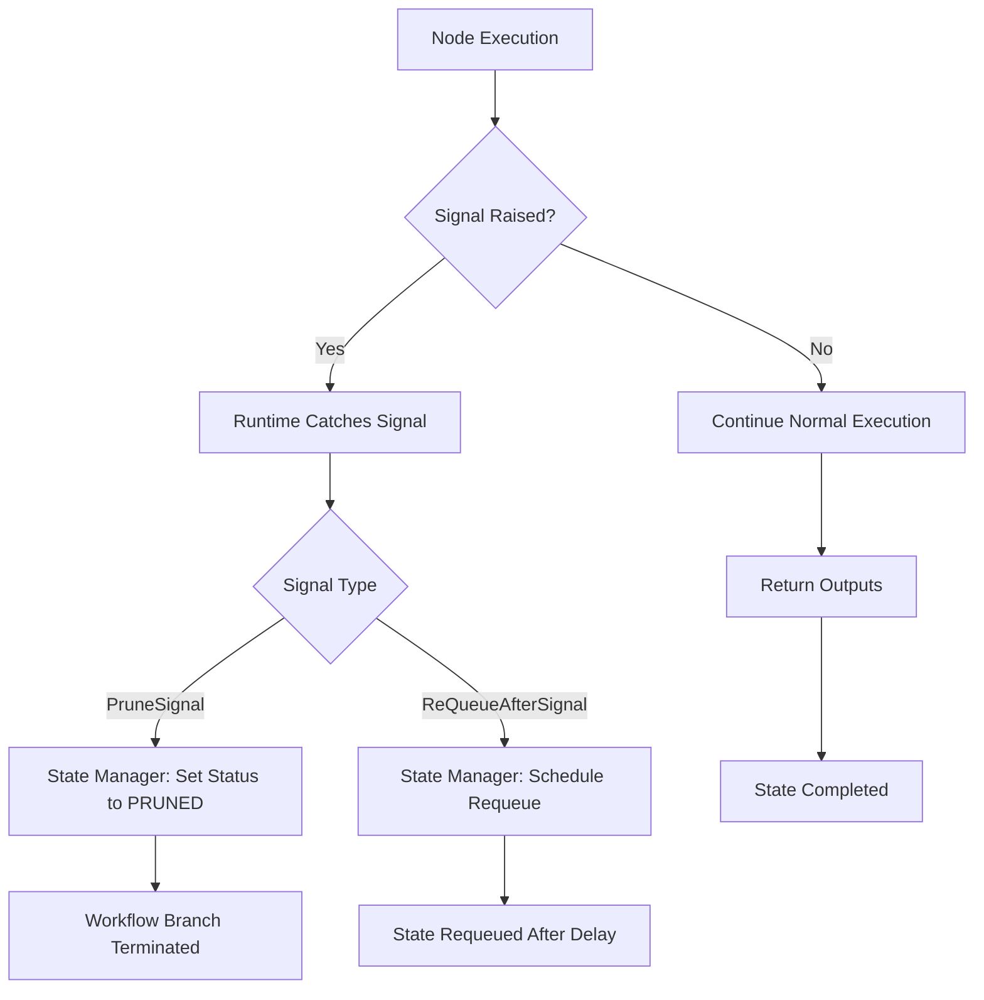

# Signals


Signals are a mechanism in Exosphere for controlling workflow execution flow and state management. They allow nodes to communicate with the state manager to perform specific actions like pruning states or requeuing them after a delay.

## Overview

Signals are implemented as exceptions that should be raised from within node execution. When a signal is raised, the runtime automatically handles the communication with the state manager to perform the requested action.



## Available Signals

### PruneSignal

The `PruneSignal` is used to permanently remove a state from the workflow execution. This is typically used when a node determines that the current execution path should be terminated.

#### Usage

```python hl_lines="13"
from exospherehost import PruneSignal

class MyNode(BaseNode):
    class Inputs(BaseModel):
        data: str

    class Outputs(BaseModel):
        result: str

    async def execute(self, inputs: Inputs) -> Outputs:
        if inputs.data == "invalid":
            # Prune the state with optional data
            raise PruneSignal({"reason": "invalid_data", "error": "Data validation failed"})
        
        return self.Outputs(result="processed")
```

#### Parameters

- `data` (dict[str, Any], optional): Additional data to include with the prune operation. Defaults to an empty dictionary.

### ReQueueAfterSignal

The `ReQueueAfterSignal` is used to requeue a state for execution after a specified time delay. This is useful for implementing retry logic, scheduled tasks, or rate limiting.

#### Usage

```python hl_lines="15"
from exospherehost import ReQueueAfterSignal
from datetime import timedelta

class RetryNode(BaseNode):
    class Inputs(BaseModel):
        retry_count: str
        data: str

    class Outputs(BaseModel):
        result: str

    async def execute(self, inputs: Inputs) -> Outputs:
        if inputs.retry_count < 3:
            # Requeue after 5 minutes
            raise ReQueueAfterSignal(timedelta(minutes=5))
        
        return self.Outputs(result="completed")
```

#### Parameters

- `delay` (timedelta): The amount of time to wait before requeuing the state. Must be greater than 0.

## Important Notes

1. **Do not catch signals**: Signals are designed to bubble up to the runtime for handling. Do not catch these exceptions in your node code.

2. **Automatic handling**: The runtime automatically sends signals to the state manager when they are raised.

3. **State lifecycle**: Signals affect the state's lifecycle in the state manager:
   - `PruneSignal`: Sets state status to `PRUNED`
   - `ReQueueAfterSignal`: Sets state status to `CREATED` and schedules requeue

## Error Handling

If signal sending fails (e.g., network issues), the runtime will log the error and continue processing other states. The failed signal will not be retried automatically.

## Examples

### Conditional Pruning

```python hl_lines="7-12"
class ValidationNode(BaseNode):
    class Inputs(BaseModel):
        user_id: str
        data: dict

    async def execute(self, inputs: Inputs) -> Outputs:
        if not self._validate_user(inputs.user_id):
            raise PruneSignal({
                "reason": "invalid_user",
                "user_id": inputs.user_id,
                "timestamp": datetime.now().isoformat()
            })
        
        return self.Outputs(validated=True)
```

### Polling

```python hl_lines="14"
class PollingNode(BaseNode):
    class Inputs(BaseModel):
        job_id: str

    async def execute(self, inputs: Inputs) -> Outputs:
        # Check if the job is complete
        job_status = await self._check_job_status(inputs.job_id)
        
        if job_status == "completed":
            result = await self._get_job_result(inputs.job_id)
            return self.Outputs(result=result)
        else:
            # Job still running, poll again in 30 seconds
            raise ReQueueAfterSignal(timedelta(seconds=30))
```

## Related Concepts

- **[Fanout](./fanout.md)** - Create parallel execution paths dynamically
- **[Unite](./unite.md)** - Synchronize parallel execution paths
- **[Retry Policy](./retry-policy.md)** - Build resilient workflows
- **[Store](./store.md)** - Persist data across workflow execution 