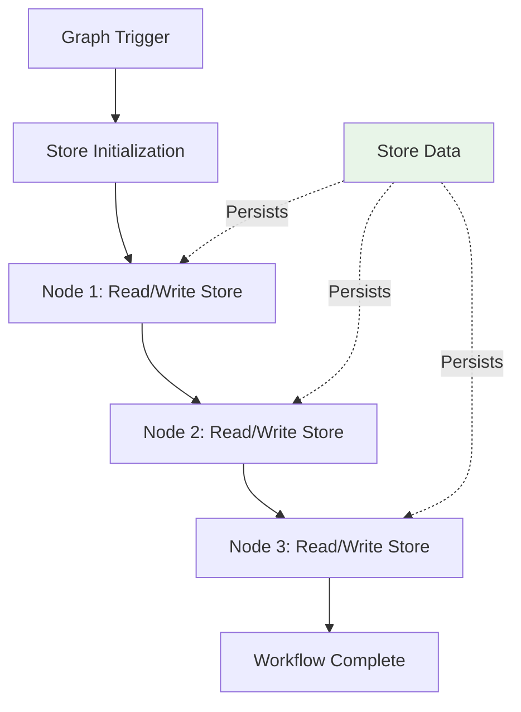

# Store

The Store is Exosphere's graph-level key-value storage system that persists data across the entire workflow execution. It provides a way to share state between nodes and maintain persistent data throughout the workflow lifecycle.

## Overview

The Store provides **persistent storage** that survives across node executions, enabling complex workflows that need to maintain state, track progress, or share data between different parts of the workflow.



## How Store Works

### Store Lifecycle

1. **Initialization**: Store is created when the graph is triggered
2. **Persistence**: Data persists across all node executions in the workflow
3. **Cleanup**: Store data is automatically cleaned up when the workflow completes

### Store Access

- **All nodes** can read from and write to the store
- **Key-value pairs** are stored as strings 
- **Automatic persistence** ensures data survives node restarts and failures

## Implementation

### Store Configuration

Define store requirements in your graph template:

```json
{
  "store_config": {
    "required_keys": ["cursor", "batch_id"],
    "default_values": {
      "cursor": "0",
      "batch_size": "100"
    }
  },
  "nodes": [
    {
      "node_name": "DataProcessorNode",
      "identifier": "processor",
      "inputs": {
        "cursor": "${{ store.cursor }}",
        "batch_size": "${{ store.batch_size }}"
      },
      "next_nodes": []
    }
  ]
}
```

### Python SDK Example

```python
from exospherehost import StoreConfigModel

store_config = StoreConfigModel(
    required_keys=["cursor", "batch_id"],
    default_values={
        "cursor": "0",
        "batch_size": "100"
    }
)

result = await state_manager.upsert_graph(
    graph_name="my-workflow",
    graph_nodes=graph_nodes,
    store_config=store_config
)
```

### Triggering with Store Data

```python
# Trigger graph with initial store values
result = await state_manager.trigger(
    "my-workflow",
    inputs={"user_id": "123"},
    store={
        "cursor": "0",
        "batch_id": "batch_001"
    }
)
```


## Store Operations

### Reading from Store

Use `${{ store.key }}` syntax to access store values:

```json
{
  "inputs": {
    "current_cursor": "${{ store.cursor }}",
    "batch_size": "${{ store.batch_size }}",
    "user_id": "${{ store.user_id }}"
  }
}
```

### Writing to Store

Store values are updated when nodes complete successfully. The store is automatically updated with any new values that nodes produce.

### Store Validation

- **Required keys**: Must be present when the graph is triggered
- **Default values**: Automatically provided if not specified
- **Key constraints**: Keys cannot contain dots (`.`) or be empty

## Next Steps

- **[Fanout](./fanout.md)** - Learn how to create parallel execution paths
- **[Unite](./unite.md)** - Synchronize parallel execution paths
- **[Signals](./signals.md)** - Control workflow execution flow
- **[Retry Policy](./retry-policy.md)** - Build resilient workflows
