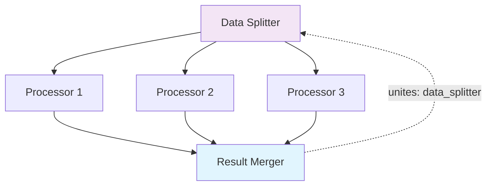

# Unite

The `unites` keyword is Exosphere's mechanism for synchronizing parallel execution paths. It allows a node to wait for multiple parallel states to complete before executing, enabling complex workflow patterns and result aggregation.

## Overview

Unite provides **intelligent synchronization** that prevents duplicate execution while ensuring all parallel paths complete before proceeding. It's essential for workflows that need to aggregate results from parallel processing or coordinate multiple execution branches.



## How Unite Works

### Basic Mechanism

When a node has a `unites` configuration:

1. **Execution is deferred** until all states with the specified identifier are complete
2. **State fingerprinting** ensures only one unites state is created per unique combination
3. **Dependency validation** ensures the unites node depends on the specified identifier

### Unite Strategies

The `unites` keyword supports different strategies to control when the uniting node should execute:

#### ALL_SUCCESS (Default)
The uniting node executes only when all states with the specified identifier have reached `SUCCESS` status.

```json
{
  "unites": {
    "identifier": "data_splitter",
    "strategy": "ALL_SUCCESS"
  }
}
```

#### ALL_DONE
The uniting node executes when all states with the specified identifier have reached any terminal status (`SUCCESS`, `ERRORED`, `CANCELLED`, etc.).

```json
{
  "unites": {
    "identifier": "data_splitter",
    "strategy": "ALL_DONE"
  }
}
```

## Implementation

### Basic Unite Example

```json
{
  "nodes": [
    {
      "node_name": "DataSplitterNode",
      "identifier": "data_splitter",
      "next_nodes": ["processor"]
    },
    {
      "node_name": "DataProcessorNode",
      "identifier": "processor",
      "inputs": {
        "data": "${{ data_splitter.outputs.chunk }}"
      },
      "next_nodes": ["result_merger"]
    },
    {
      "node_name": "ResultMergerNode",
      "identifier": "result_merger",
      "inputs": {
        "processed_data": "${{ processor.outputs.result }}"
      },
      "unites": {
        "identifier": "data_splitter"
      },
      "next_nodes": []
    }
  ]
}
```

### Python SDK Example

```python
from exospherehost import GraphNodeModel, UnitesModel, UnitesStrategyEnum

graph_nodes = [
    GraphNodeModel(
        node_name="DataSplitterNode",
        identifier="data_splitter",
        next_nodes=["processor"]
    ),
    GraphNodeModel(
        node_name="DataProcessorNode",
        identifier="processor",
        inputs={"data": "${{ data_splitter.outputs.chunk }}"},
        next_nodes=["result_merger"]
    ),
    GraphNodeModel(
        node_name="ResultMergerNode",
        identifier="result_merger",
        inputs={"processed_data": "${{ processor.outputs.result }}"},
        unites=UnitesModel(
            identifier="data_splitter",
            strategy=UnitesStrategyEnum.ALL_SUCCESS
        ),
        next_nodes=[]
    )
]
```

## Use Cases

- **Data Merging**: Combine results from parallel data processing
- **Batch Completion**: Wait for all parallel batches to finish
- **Summary Generation**: Aggregate results from multiple sources

## Strategy Selection

### ALL_SUCCESS Strategy
**Use when:**
- You need all parallel processes to complete successfully
- Partial failures are not acceptable
- Data integrity is critical

**Example scenarios:**
- Financial transaction processing
- Data validation workflows
- Critical business processes

**Caution:** This strategy can block indefinitely if any parallel branch never reaches SUCCESS status.

### ALL_DONE Strategy
**Use when:**
- You want to proceed with partial results
- You have error handling logic in the uniting node
- Some failures are acceptable

**Example scenarios:**
- Data collection from multiple sources
- Batch processing with error tolerance
- Monitoring and alerting systems


## Integration with Other Concepts

### Unite + Fanout
Unite is most commonly used with fanout to synchronize parallel execution:

1. **Fanout creates parallel paths** (e.g., processing multiple data chunks)
2. **Unite synchronizes completion** (e.g., merging all processed results)
3. **Automatic coordination** ensures proper execution order

### Unite + Retry Policy
- **Independent retries**: Each parallel branch retries independently
- **Unite waits for final status**: Unite considers the final status after all retries
- **Consistent behavior**: All branches use the same retry policy


## Next Steps

- **[Fanout](./fanout.md)** - Learn how to create parallel execution paths
- **[Signals](./signals.md)** - Control execution flow in parallel branches
- **[Retry Policy](./retry-policy.md)** - Build resilience into parallel workflows
- **[Store](./store.md)** - Share data across parallel execution paths
