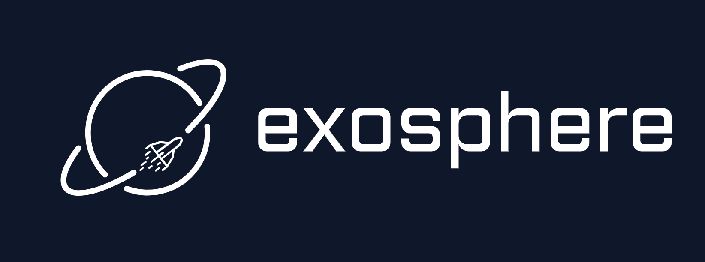

  
  
  
  
  
  
  

# Exosphere: Reliablity runtime for AI agents

**Exosphere** is a lightweight runtime to make AI agents resilient to failure and infinite scaling across distributed compute. With a few changes to your existing agent code, take your agent from demo to deployment.

## Why Exosphere?

Exosphere provides a powerful foundation for building and orchestrating AI applications with these key capabilities:

### [Lightweight Runtime](./exosphere/architecture.md)

Execute workflows reliably with minimal overhead across distributed infrastructure using a state-based execution model.

### [Inbuilt Failure Handling](./exosphere/retry-policy.md)

Built-in retry policies with exponential backoff and jitter strategies for resilient, production-grade execution.

### [Infinite Parallel Agents](./exosphere/fanout.md)

Scale to unlimited parallel agents with automatic load distribution and dynamic fanout at runtime.

### [Dynamic Execution Graphs](./exosphere/concepts.md)

Durable execution designed for agentic flows with node based control of execution. 

### [Native State Persistence](./exosphere/store.md)

Persist workflow state across restarts and failures with graph-level key-value storage.

### [Observability](./exosphere/dashboard.md)

Visual monitoring, debugging, and management of workflows with real-time execution tracking.

Whether you're building data pipelines, AI agents, or complex workflow orchestrations, Exosphere provides the infrastructure backbone to make your AI applications production-ready and scalable.

---

**Watch the Step by Step Demo**:

---

## Run your first agent

### [Getting Started](./getting-started.md)

Get the Exosphere State Manager and Dashboard running locally for development.

### [Run your first Node](./exosphere/register-node.md)

Create your first node and register it with the Exosphere runtime.

### [Trigger Agent](./exosphere/trigger-graph.md)

Learn how to trigger your agent workflows and manage execution flows.

### [Deploy & Monitor](./exosphere/dashboard.md)

Deploy your agents and monitor their execution with the visual dashboard.

## Open Source Commitment

We believe that humanity would not have been able to achieve the level of innovation and progress we have today without the support of open source and community, we want to be a part of this movement!

Please feel free to reach out to us at [nivedit@exosphere.host](mailto:nivedit@exosphere.host). Let's push the boundaries of possibilities for humanity together!

## Contributing

We welcome community contributions. For guidelines, refer to our [CONTRIBUTING.md](https://github.com/exospherehost/exospherehost/blob/main/CONTRIBUTING.md).

Thanks to our awesome contributors!

